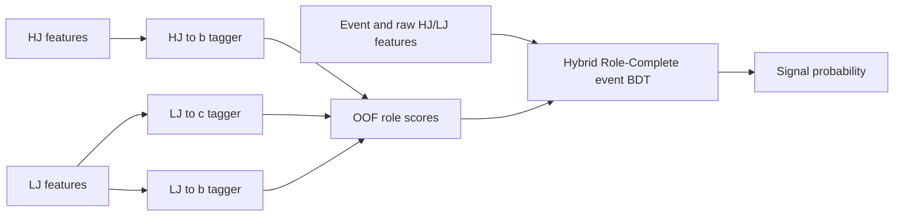

# Hybrid Role-Complete BDT

Minimal reference implementation of a two-stage, leakage-safe BDT architecture.
It contains no event selection, physics weights, significance formula, coupling
normalization, plotting, detector configuration, or cluster-specific code.

## Architecture

The design separates object-level flavor evidence from event-level classification.
Stage 2 keeps the raw reconstructed features while adding nonlinear role hypotheses
from Stage 1, so the final model can correct imperfect taggers instead of treating
their decisions as hard cuts.

1. Three role-specific Stage-1 taggers are trained:
   `HJ -> b`, `LJ -> c`, and `LJ -> b`.
2. Training-event Stage-1 scores are strictly out-of-fold (OOF). Validation and
   test scores are averages over the fold models trained only on the training split.
3. The Stage-2 event BDT receives:
   - user-selected event features;
   - user-selected HJ and LJ features;
   - the three Stage-1 probabilities;
   - three deterministic role-score combinations.
4. Truth flavor is used only to supervise Stage 1 and is rejected from every
   model feature list.



## Input contract

`events` contains one row per event:

```text
event_id | label | split | <event features...>
```

`jets` contains exactly one `HJ` and one `LJ` row per event:

```text
event_id | role | truth_flavor | <jet features...>
```

`split` must be one of `train`, `validation`, or `test`. The caller controls the
split and therefore remains responsible for defining an appropriate independent test set.

The exact 10 TeV tc plot contract is provided separately:

- [feature definitions](FEATURE_DEFINITIONS.md);
- [samples, weights, selection, training parameters, threshold rule, and ordered feature lists](configs/tc_10tev_plot_contract.yaml).

## Usage

```python
from BDT.src.hybrid_role_complete import HybridRoleCompleteBDT

model = HybridRoleCompleteBDT(
    event_features=["visible_energy", "missing_pt", "thrust"],
    jet_features=["mass", "pt", "tau1", "tau2", "track_count"],
    n_folds=5,
    device="cpu",
)

model.fit(events, jets)
print(model.metrics_)          # validation/test ROC AUC
test_scores = model.test_scores_
new_scores = model.predict_proba(new_events, new_jets)
```

The implementation intentionally leaves feature definitions, event selection,
sample weighting, and physics interpretation to the analysis using the model.

## Other reference baselines

- [R015 single-stage T0](baselines/t0_r015/): an independent 18-input event BDT
  with its verified historical training recipe, feature definitions, and contract.
